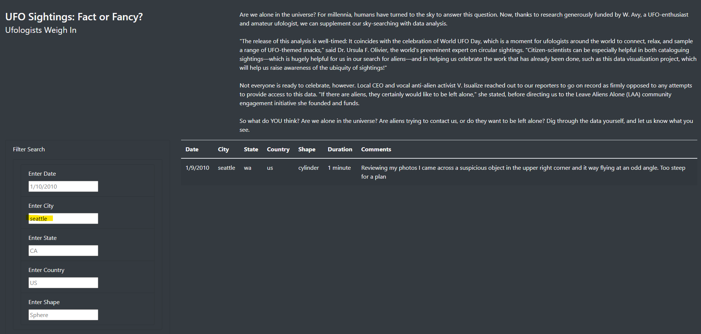

# UFOs

## Project Overview

The purpose of this project is to build a dynamic webpage by inserting JavaScript into an HTML page. The webpage allows users to interact with data from UFO sightings by filtering the data based off of user inputs and displaying it in a neat table.

## Development Environment

* JavaScript
* HTML
* CSS

## Results

When the user clicks on the link to the website, they will see the landing page, as shown below:

When the user scrolls down, they are presented with five different filters with which they are able to customize the table. When the user searches UFO sightings containing specific criteria, the table automatically updates. In this example, the user searched for UFO sightings in Seattle and was presented with the following results on the webpage:\

## Summary

One drawback of this webpage is that users need to have prior knowledge of UFO sightings by date, city, state, country, or shape. This can be improved by adding drop-down lists of suggested filters as the user starts typing.

Additionally, the current webpage requites users to manually delete the criteria they entered in the text box to reset the table. The webpage can be made more responsive by adding a "Clear Filters" button.

